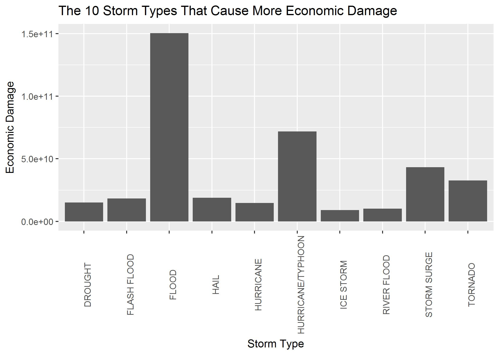
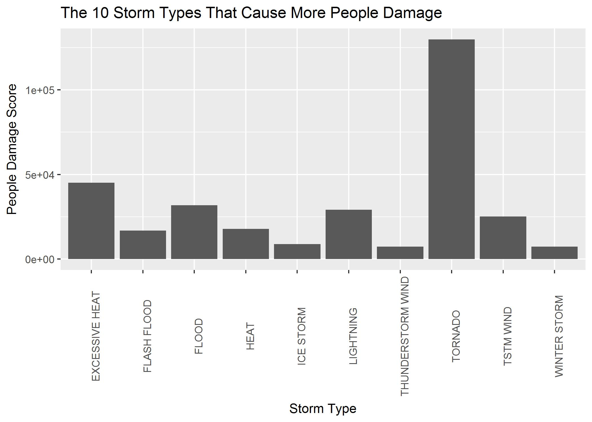

```{r setup, include=FALSE, cache=TRUE, echo=FALSE, results='hide'}
library(knitr)
library(dplyr)
imgdir <- "./images/"
peopledmg_plot <- paste(imgdir,"peopledmg.jpg",sep="")
ecodmg_plot <- paste(imgdir,"ecodmg.jpg",sep="")
knitr::opts_chunk$set(echo = TRUE, results='markup', warning = F)
```

# Synopsys  
A descriptive analysis to identify which storm types are most harmful for  

- population (injuries, fatalities)  

- economy (crops, properties)  

## Overview  
Using the raw data available [at NOOA](http://www1.ncdc.noaa.gov/pub/data/swdi/stormevents/csvfiles/) (documented [here](http://www1.ncdc.noaa.gov/pub/data/swdi/stormevents/csvfiles/Storm-Data-Export-Format.docx)) after some laborious computations to make the raw data more easy to analyze we were able to perform a simple analysis to identidy the 10 storm types most harmful to population health and with the greatest economic consquences.  

## Results and limitations  

### Economic Damage
The 10 storm types producing more economic damage are:  

1. FLOOD  

1. HURRICANE/TYPHOON  

1. STORM SURGE  

1. TORNADO  

1. HAIL  

1. FLASH FLOOD  

1. DROUGHT  

1. HURRICANE  

1. RIVER FLOOD  

1. ICE STORM  




### Storm types most harmful to population health  

We have data about both fatalities and injuries.
To provide a unque overall measure we created an index so defined:  
<div  style="text-align:center;" markdown="1"><b>fatalities * 10 + injuries * 4</b></div>  
ie. in a certain way we gave weight 10 to fatalities and 4 to injuries.  

The ranking of the "harm to population health was based on this index and this index is shown in the plot.  
The 10 storm types that produced more people damage are  

1 TORNADO  

2 EXCESSIVE HEAT  

3 FLOOD  

4 LIGHTNING  

5 TSTM WIND  

6 HEAT  

7 FLASH FLOOD  

8 ICE STORM  

9 WINTER STORM  

10 THUNDERSTORM WIND  




### Limitations  
Both for economy and population health damage we show the 10 most harmful storm types.  
The years for which less data were available (<10k observations), were not included in the analysis.

Due to resource constraints, to the low-power hardware available and the fact that the data preprocessing consumed a lot of resources/time, analysis was rather direct and there was no room for more refined analysis or for preprocessing that might have allowed additional analysis.

Example of analysis not performed: 

- eventual "intersection" among the storm types most harmful to people and economy   

Example of preprocessing not performed:  

- aggregating the event types, that are 985, and so might be overlapping and redundant (we see both hurricane/Typhoon and Typhoon for instance), and, even if not overlapping, still are too numerous, supercategories might have provided a more easily understandable analysis  

## Data Processing  
The data presented some peculiarities that required a laborious preprocessing.  
<b>All the preprocessing steps</b>, in the form of R code, <b>are included in this document</b>, so it is <b>possible to go from the (url to download the) raw data, to the analytics data in a reproducible way</b>.  
Some of the peculiarities of the data were:  

- high number of observations, relative to student's background, and high 
relative to the capabilities of the hardware available, a laptop.Reading the data was extremely slow and in several places a "lazy"  approach was taken.  

- only a small number of variables are actually necessary to anwer the "questions" that are the objective of this study  

- the two numeric data needed to answer the questions were each spread in two columns, one with a figure, the other with the multiplier expressed as an exponent of 10

- data of the exponents were "dirty" ie in a mixed format (digit, 'h','k','M','B') and often  missing

### Techical data transformations for performance
By technical we mean that NO data model transformation is performed, only modification to storage format.  
Data are relatively large and take several minutes to load. An attempt to reduce this loading time has been made, based on:   

- lazy loading: download from internet if local <b>.csv.bz2</b> file not present

- avoid reading directly compressed file, decompress .bz2 and read .csv, this under the assumption that reading uncompressed files is faster (assumption not punctually verified but based on first attempts to read directly compressed file, that had much longer times or hanged, all were manually terminated after running for an extremely long time)  

- lazy decomopression: decompress .bz2 if .csv not present  

- save to .rds, under the assumption, supported by previous experiences of the author, and some internet posts, that .rds files are faster [stackoverflow post 1](http://stackoverflow.com/questions/4756989/how-to-load-data-quickly-into-r)  [stackoverflow post 2](http://stackoverflow.com/questions/11559628/speed-up-rdata-load)  

```{r dataTechProcessing}
destfilestem <- "data/StormData"
csvfile <- paste(destfilestem,".csv",sep="")
bz2file <- paste(csvfile,".bz2",sep="")
RDSFile <- paste(destfilestem,".rds",sep="")

if (!file.exists("data")){
    dir.create("data")
}

# lazy download remote file
if(!file.exists(bz2file)){
  url <- "https://d396qusza40orc.cloudfront.net/repdata%2Fdata%2FStormData.csv.bz2"
  es <- tryCatch(download.file(url, bz2file
    ,method = "auto", quiet = FALSE)
    ,error=function(e) 1)
}
# lazy uncompress, not strictly necessary, hoping that makes things faster
if(!file.exists(csvfile)){
  library(R.utils)
  bunzip2(bz2file,csvfile,remove = FALSE, skip = TRUE)
}
# read data  destfile
if (!file.exists(RDSFile)) {
  tempo <- system.time({
    data_org <- read.csv(csvfile)
    })
  saveRDS(data_org,RDSFile,compress = FALSE)
}
if (!exists(deparse(substitute(data_org)))) {
  data_org <- readRDS(RDSFile) 
}
```
Check NAs
```{r dataCheck}
countNAs <- sapply(1:ncol(data_org), function(x) sum(is.na(data_org[x])))
colsWithNAs <- which(countNAs > 0)
names(data_org)[colsWithNAs]
```

### Logical data processing
We have many variables
```{r exploratoryDataAnalysis}
str(data_org)
```
Keep only the few variables useful to answer the "questions"
```{r preprocessingColumns}
data <- data_org[ , c("BGN_DATE", "EVTYPE", "FATALITIES", "INJURIES", "PROPDMG", "PROPDMGEXP", "CROPDMG", "CROPDMGEXP")]
```
Upper case variable names are error prone and not aligned with my personal standards, converting them to lower case
```{r namesCase}
names(data) <- tolower(names(data))
```
Creating the score to rank people damage and a year column
```{r addVars}
library(dplyr)
data <- dplyr::mutate(data
  # index for people damage
  ,people_dmg_score = fatalities*10+injuries*4
  ,year = as.numeric(format(as.Date(data$bgn_date, format = "%m/%d/%Y"), "%Y")))

```

We know that data tend to be of low quality and that we have many compared to our HW processing power, so we ignore all the years with less than 10000 observations
```{r removeYearsFewObs}
obs_treshold <- 10000
years_grp <- group_by(data,year)
year_obs <- summarize(years_grp, obs_year = n())
year_ord <- order(year_obs$obs_year)
years_ok <- year_obs[year_obs$obs_year > obs_treshold, ]$year
data <-data[data$year %in% years_ok, ]
```

Transform exponent columns from factors to chars to simplify processing
```{r factorsToChars, results='hide'}
data$propdmgexp <-  lapply(data$propdmgexp, as.character)
data$cropdmgexp <-  lapply(data$cropdmgexp, as.character)

```

Value for property and crop damage is, in both cases, split in two columns

- propdmg, propdmg<b>exp</b>  

- copdmg, cropdmg<b>exp</b>  

I build two new columns, property and crops, containing the values
```{r calculateValues, results='hide'}

multiplier <- function(x){
if (is.na(x) || nchar(x) == 0) 
    return(1)
if(is.numeric(x)) {
    return(10^x)
}
myexp <- switch(tolower(x),
    " " = 0, "-" = -1, "+" = 1
    ,"0" = 0, "1" = 1, "2" = 2, "3" = 3, "4" = 4, "5" = 5
    ,"6" = 6, "7" = 7, "8" = 8, "9" = 9, 
    "h" = 2, "k" = 3, "m" = 6, "b" = 9,
    0
  )
  10^myexp
}

j <- 0 
data$property <- sapply(1:nrow(data), function(i) {
  if (is.na(data[i,5]) || data[i,5] == 0)
    return(0)
  ret <- data[i,5]*multiplier(data[i,6])
  j <<- j+1
  return(ret)
  })
j <- 0
data$crops <- sapply(1:nrow(data), function(i) {
  if (is.na(data[i,7]) || data[i,7] == 0)
    return(0)
  ret <- data[i,7]*multiplier(data[i,8])
  j <<- j+1;  if (j%%1000 == 0) cat(" ",j/1000)
  return(ret)
  })

data$econ_dmg <- data$property + data$crops
# tactical :-)
saveRDS(data,"data_ok.rds")
```


Plot the 10 event types most harmful to population health,   
save plot to disk to use it at beginning of document 
```{r plotPeopleDamage}
evtype_grp <- group_by(data,evtype)
people_dmg_sums <- summarize(evtype_grp,people_sum = sum(people_dmg_score))
people_order <- people_dmg_sums[order(-people_dmg_sums$people_sum), ]
# people_order[(people_order$people_sum > 0),]

library(ggplot2)
toPlot <- people_order[1:10,]
p <- ggplot(toPlot, aes(evtype,people_sum))
p <- p + geom_bar(stat='identity')
p <- p + theme(axis.text.x=element_text(angle=90))
p <- p + ggtitle("The 10 Storm Types Most Harmful To Population Health")
p <- p +xlab("Storm Type")
p <- p +ylab("People's Health Harmfulness Score")
ggsave(peopledmg_plot,p)

```

Plot the 10 storm types with the greatest economic consquences,   
save plot to disk to use it at beginning of document 
```{r plotProperty}
library(dplyr)
library(ggplot2)

# economic damage
evtype_grp <- group_by(data,evtype)
eco_dmg_sums <- summarize(evtype_grp,eco_sum = sum(econ_dmg))
eco_order <- eco_dmg_sums[order(-eco_dmg_sums$eco_sum), ]
eco_order[(eco_order$eco_sum > 0),]
eco_order <- eco_order[1:10, ]

e <- ggplot(eco_order, aes(evtype,eco_sum))
e <- e + geom_bar(stat='identity')
e <- e + theme(axis.text.x=element_text(angle=90))
e <- e + ggtitle("The 10 Storm Types That Cause More Economic Damage")
e <- e +xlab("Storm Type")
e <- e +ylab("Economic Damage")
ggsave(ecodmg_plot,e)
```
